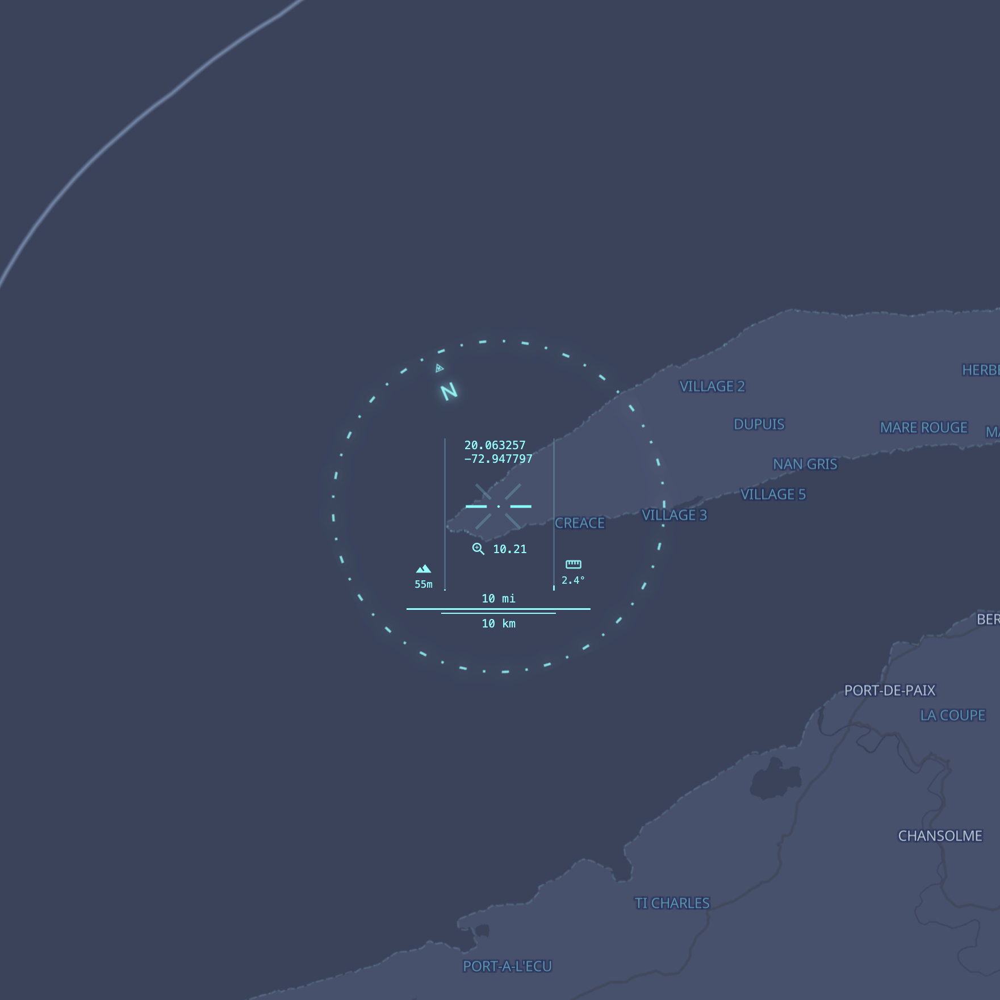

# WDGTS


**[Download 60 fps demo video](public/wdgt-compass-demo.mp4)**

A modular widget system for GIS and mapping applications. Self-contained, reusable components built for MapTiler SDK and MapLibre GL.




## Features

### Compass Widget
- 3D compass ring with rotation and pitch tilt
- Real-time coordinates, zoom, pitch, and altitude display
- Dual scale bars (imperial/metric)
- Crosshair targeting system
- HUD-style interface

### Audio
- Programmatic sound effects via Web Audio API
- Configurable parameters

## Quick Start

```bash
# Install dependencies
npm install

# Configure API key
# Create src/config.js with your MapTiler API key
const config = {
  MAPTILER_API_KEY: "your-key-here"
};

# Start dev server
npm run dev
```

## Usage

- **CMD+.** - Toggle UI visibility
- **S** - Cycle map styles
- **Shift+A** - Polygon drawing mode
- **Delete** - Remove selected features

## Tech Stack

- MapTiler SDK
- TerraDraw
- Web Audio API
- Vite

## License

MIT License - see [LICENSE](LICENSE) file for details.
